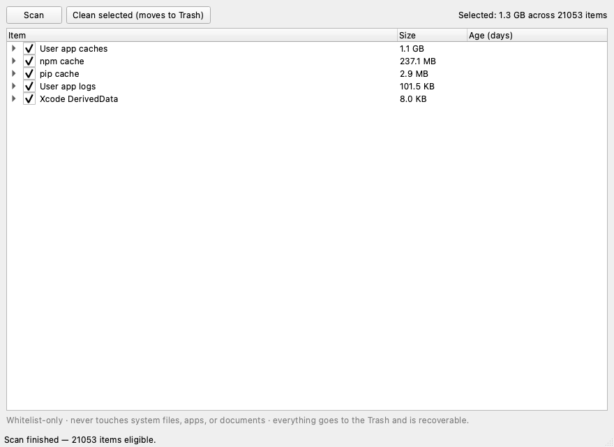

# MacSweep — Safe Storage Cleaner for macOS
<br clear="left">

[](https://github.com/samimohameed/macsweep/actions/workflows/ci.yml)
[](LICENSE)


A free, open-source alternative to CleanMyMac for reclaiming disk space from caches, logs, and developer-tool build artifacts. **Whitelist-only by architecture**: it cannot touch the OS, system files, installed applications, or your personal data — the safety rules are enforced in code, not by convention, and covered by CI-run tests.



|  | MacSweep | CleanMyMac | DaisyDisk |
|---|---|---|---|
| Price | **Free, MIT** | $40/yr | $10 |
| Open source | **Yes** | No | No |
| Can touch system files / your documents | **No — blocked by architecture** | Yes | Yes |
| Needs admin rights | **Never** | Yes | For some ops |
| Recoverable by default (Trash) | **Yes** | Partially | No |

Comes as both a **desktop app** and a CLI. The core requires only Python 3.9+ (included with macOS Command Line Tools) and has zero third-party dependencies; the GUI optionally uses PySide6. Never needs `sudo` — refuse to run it with `sudo`.

## Desktop app

```bash
python3 -m pip install 'macsweep[gui]'   # or from a clone: pip install -e '.[gui]'
python3 -m macsweep gui
```

Scan, review every item with checkboxes grouped by category, and clean with one click. The GUI **only ever moves items to the Trash** — everything stays recoverable; permanent deletion is deliberately CLI-only.

Wondering why a scan offers less than other cleaners claim? Click **Show skipped** — MacSweep lists every item it saw but left alone, with the exact safety rule that protected it. Deleting a cache an app used yesterday just makes the app rebuild it, so honest numbers beat big numbers.

## CLI quick start

```bash
cd macsweep

# See what it's allowed to clean
python3 -m macsweep targets

# Read-only scan: shows reclaimable space, removes nothing
python3 -m macsweep scan

# Dry run of a clean (default — still removes nothing)
python3 -m macsweep clean

# Actually clean: items are moved to Trash (fully recoverable)
python3 -m macsweep clean --yes

# Include old Trash items (opt-in, permanent, double-confirmed)
python3 -m macsweep clean --include trash --permanent --yes
```

Useful options: `--only user-caches` (restrict targets), `--min-age 30` (only touch older items; can only raise the built-in minimums), `-v` (show skipped items and why).

## Safety model — defense in depth

1. **Whitelist-only scanning.** The scanner can only iterate locations in a hardcoded registry (`infrastructure/macos_targets.py`): user-scope caches, logs, Xcode DerivedData, Homebrew/npm/yarn/pip caches. There is no code path that walks arbitrary directories.
2. **Independent blocklist.** `SafetyPolicy` re-checks every path against protected prefixes (`/System`, `/Library`, `/usr`, `/Applications`, `~/Documents`, `~/Desktop`, `~/Downloads`, `~/Library/Application Support`, `~/Library/Preferences`, Keychains, Mail, Photos, iCloud Drive, cloud-storage mounts, …). Even a misconfigured target cannot reach them.
3. **Symlink-escape protection.** Paths are resolved to their real location and must remain inside their target root. A cache entry that symlinks to your Documents folder is skipped, never followed.
4. **Age gate.** Items modified recently (per-target minimum: 3–30 days, using the *newest* file inside a directory) are never touched, so active caches are left alone.
5. **Dry run by default.** `clean` without `--yes` changes nothing.
6. **Recoverable by default.** Cleaning moves items to the Trash via Finder; permanent deletion requires the explicit `--permanent` flag plus typing `DELETE` at a confirmation prompt.
7. **Re-validation at removal time.** Every item passes the full safety policy a second time immediately before removal, in the single code path (`CleanUseCase`) through which anything can be removed.
8. **No elevation.** The tool operates on user-scope locations only, so it never asks for or needs administrator rights. System-managed caches (`/private/var/folders`, `/Library/Caches`) are deliberately excluded — macOS maintains those itself.

## Architecture (Clean Architecture)

```
macsweep/
├── domain/            # Enterprise rules — zero dependencies, pure Python
│   ├── entities.py    #   CleanupTarget, CleanupItem, ScanReport, CleanReport
│   └── policies.py    #   SafetyPolicy (the guard layer)
├── application/       # Use cases — depend only on domain + ports
│   ├── ports.py       #   FileSystemPort, RemoverPort, ReporterPort (Protocols)
│   ├── scan.py        #   ScanUseCase (read-only)
│   ├── clean.py       #   CleanUseCase (sole removal path)
│   └── app_service.py #   AppService facade shared by all UIs
├── infrastructure/    # Adapters — implement the ports
│   ├── fs_adapter.py  #   LocalFileSystem
│   ├── trash.py       #   TrashRemover (Finder), PermanentRemover
│   └── macos_targets.py  # the whitelist registry
├── presentation/
│   ├── cli.py         # argparse CLI (UI only)
│   └── gui/           # PySide6 desktop app (UI only; background workers)
└── composition.py     # the single composition root (all DI wiring)
```

Dependency rule: source-code dependencies point inward only (presentation → application → domain; infrastructure implements application ports). The CLI and GUI are thin shells over the same `AppService` facade — neither contains business logic, and both are wired through one composition root. The domain layer imports nothing outside itself, so the safety rules are trivially unit-testable.

## Tests

```bash
python3 tests/test_safety.py          # or: python3 -m pytest tests/ -v
```

14 tests cover the safety guarantees: rejection of system paths, applications, and user data; symlink-escape handling; dry-run behavior; clean-time re-validation of hostile items; the age gate; and the happy path.

## Extending / contributing

Add a new location by appending a `CleanupTarget` to `default_targets()` — nothing else changes. The `SafetyPolicy` blocklist still applies on top of whatever you add.

See [CONTRIBUTING.md](CONTRIBUTING.md) for the safety ground rules, development setup, and how to propose new cleanup targets. Adding a target is a great first PR.

## Roadmap

- Menu-bar companion showing reclaimable space at a glance
- App uninstaller with leftover finder
- More developer caches (Docker, Gradle, CocoaPods, Cargo, old simulators)
- Large/old file and duplicate finders (report-only)
- Homebrew cask + signed, notarized `.app` releases
- Scheduled cleaning via launchd
